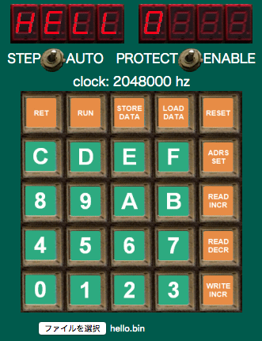
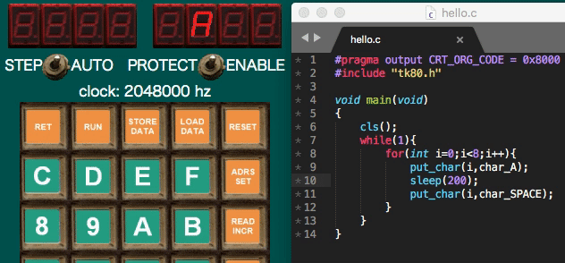

# zk80web_sample

[zk-80 web(TK80エミュレータ)](http://hp.vector.co.jp/authors/VA016157/zk80web04/zk80web.html)
のサンプルプログラムとビルドスクリプトです。

zk-80 webの使い方は[こちら](http://hp.vector.co.jp/authors/VA016157/zk80web04/help/)。

# requirement

- [z88dk](https://github.com/z88dk/z88dk)(に含まれるz80asm)
- python3

# サンプルプログラム(アセンブラ)

```
ORG 0x8000

ld hl,hello_txt
ld de,0x83f8     ; 7seg buffer
ld bc,8          ; letters
ldir
halt

hello_txt:
defb 0x76,0x79,0x38,0x38,0x3f,0x00,0x00,0x00
```

0x83f8は7SEGのバッファで、ここに7SEGの点灯パターンを書き込めば任意のパターンを表示できるそうです。[try's pageさんのTK-80のページ](http://www.st.rim.or.jp/~nkomatsu/evakit/TK80.html)などが参考になります。

## ビルド

```
cd hello
make
```

hello.binができます。冒頭にリトルエンディアンで開始アドレスを書くのがお作法のようなので、insert_addr.pyでその処理を行っています。

## 実行

[エミュレータ](http://hp.vector.co.jp/authors/VA016157/zk80web04/zk80web.html)を開いて

- [ファイルを選択]にhello.binを指定
- [LOAD DATA]を押す
- [RUN]を押す




# サンプルプログラム(C言語)



cフォルダを参考にしてください。

メモリ1kbyteでは実用的なプログラムは難しそうですね。。

# 補足

オリジナルのTK80のCPUは8080Aですが、zk-80はZ80エミュレータがベースなようです。Z80は8080の上位互換なので、律儀な人は8080互換命令だけでプログラムを組むといいでしょう。

なお、ここのサンプルプログラムで使ったブロック転送命令ldirは8080にはなくZ80で追加された命令なのでオリジナルTK80では動かないと思われます。
